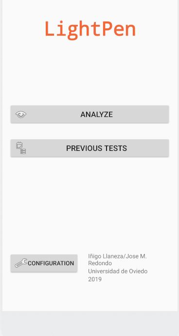
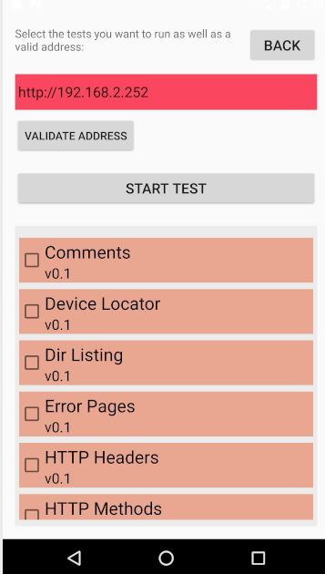
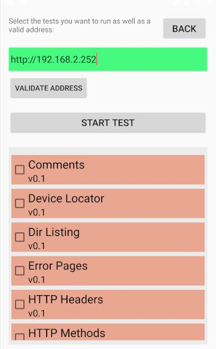
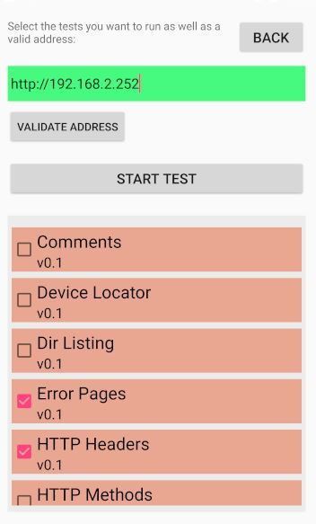
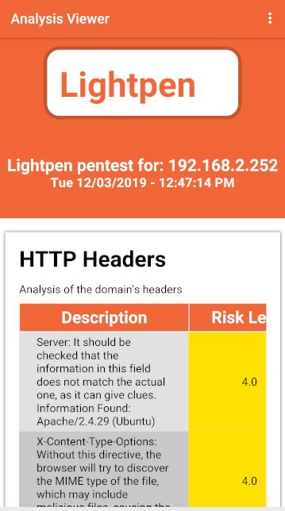
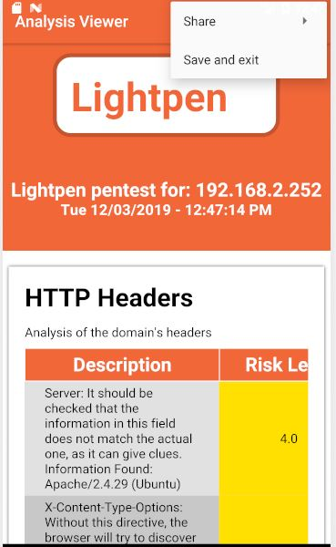
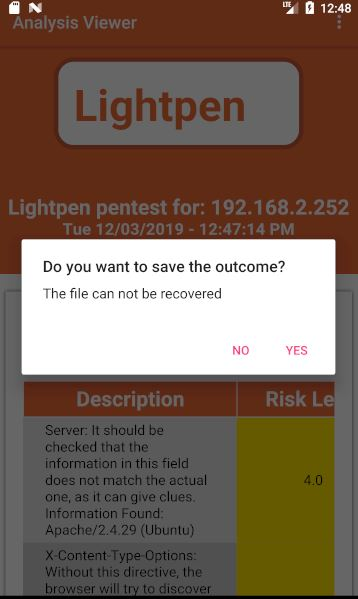
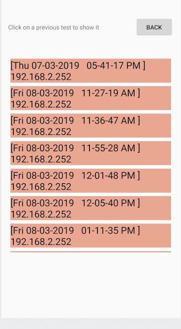
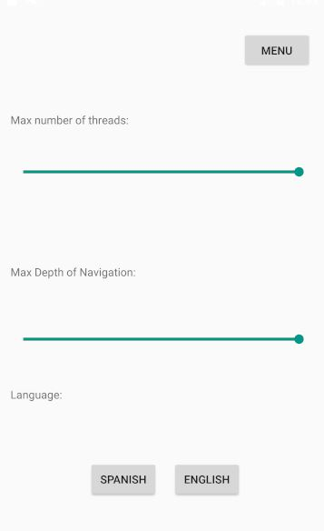

# LightPen
Lightpen mobile pentesting tool V1.1

## Description

Lightpen is a lightweight mobile pentesting tool enabling several security scanning activities from any
Android device. It does not need root permissions, and all the scanning activities are aimed to offer
agile responses and low disruption to the target. Lightpen is being used to gather information to remote 
systems at any place so we can quickly check if these systems are very vulnerable or as a previous step
to perform a full security audit so we can gather information that may enable us to better design the 
audit activities, saving resources and time. 

Currently, Lightpen implements the following plugins. Each plugin is a different pentesting activity:

* **HTTP Headers**: Analyze HTTP headers to check if some security-related headers have been activated (HSTS, HKPK, XSS protections...). 
* **Robots.txt**: Checks if there is a robots.txt file and analyzes their contents to check if it may facilitate other attacks. 
* **URL Mapper**: Creates an URL map and allows us to view URLs to check that undesired URL are not being referred. 
* **HTTP Methods**: Analyzes the HTTP Methods supported by a server, checking that no dangerous method is supported. 
* **Ports**: Analyzes open TCP and UDP ports in a server, identifying the running services, in case they may suppose a security problem. 
* **Error Page**: Checks if there are default error pages providing too much information about the remote system. 
* **Dir Listing**: Checks if a server has directory listings enabled, giving too much information about their contents. 
* **Comments**: Locate and report different types of comments in the web page to avoid offering too much information about the system. 
* **Device Locator**: Scans and identifies devices in the remote system subnet using the ARP cache.

This is an ongoing research project to test the feasibility of a portable auditing system, and therefore
is still under development. 

## Usage

Once the application runs you will see the welcome screen. From here we can perform a new test or check the previous ones.

If we decide to perform a new test, we first have to choose a target. The validate address button enables us to check if it is reachable.

If the text field turns green, the target is reachable from the application. If turned red, the pentest activity cannot be performed over this target from the current location.

If the target is reachable, we can choose any combination of plugins available (see previous section)

Once the tests finish, we can review their results in the generated results HTML page
  

The report can be shared with any installed application accepting text/html format or saved to a file

Saving to a file needs confirmation.

Once saved, we can review a list of the previous test that the tool has made and its complete results.

The application also has a small configuration section accessible from the welcome screen.
 

## Pentesting results examples

* This is a sample scan to the popular website scanme.nmap.org: [Pentest to scanme.nmap.org](/pentestingResults/Lightpen_Report_scanme.html)
* This is a scan with all plugins active: [AllPlugins](/pentestingResults/LightpenReportAllPlugins.html)
* This is a scan with the Comments plugin: [Comments](/pentestingResults/LightpenReportComments.html)
* This is a scan with the Device Locator plugin: [Device Locator](/pentestingResults/LightpenReportDevices.html)
* This is a scan with the Directory Listing plugin: [Directory Listing](/pentestingResults/LightpenReportDirListing.html)
* This is a scan with the Error Pages plugin: [Error Pages](/pentestingResults/LightpenReportErrorPages.html)
* This is a scan with the HTTP Headers plugin: [HTTP Headers](/pentestingResults/LightpenReportHeaders.html)
* This is a scan with the HTTP Methods plugin: [HTTP Methods](/pentestingResults/LightpenReportMethods.html)
* This is a scan with the Port Scan plugin: [Port Scan](/pentestingResults/LightpenReportPorts.html)
* This is a scan with the Robots.txt plugin: [robots.txt](/pentestingResults/LightpenReportRobots.html)
* This is a scan with the HTTP Headers plugin where a Server header is located and reported: [Server header](/pentestingResults/LightpenReportServer.html)
* This is a scan with the URL Scan plugin: [URL Scan](/pentestingResults/LightpenReportURLScan.html)

## Sources and binaries

The last stable version of the source code and its binaries are available in the [releases](https://github.com/jose-r-lopez/LightPen/releases) section.

To import the project in Android Studio, just download the sources and unzip them in any folder you like. Then, you just have to use the "Import project" option
and locate the folder "Lightpen-master" to import it. Android Studio sometimes gives problems with long routes or with folder permisssions, therefore is 
recommendable to use a suitable route to unpack the sources.

Testing from Android Studio have been done with an Emulated Google Pixel XL (Android 7.0, API 24). Newer versions should work without problems.

## More info

See [javadoc](https://jose-r-lopez.github.io/LightPen/) of the current version of the project

## Author

Iñigo Llaneza Aller, Jose Manuel Redondo López
